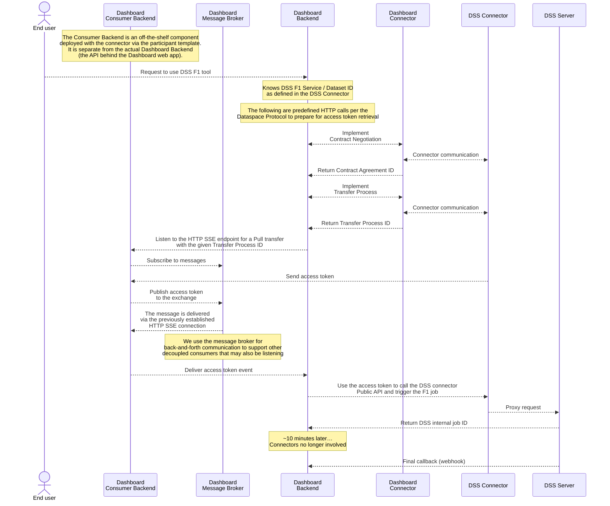

# Dashboard-DSS Integration Example

Proof-of-concept implementation demonstrating Dashboard interaction with the DSS tool via connectors.

```mermaid
sequenceDiagram
    actor USER as End user
    participant CONSBACK as Dashboard<br/>Consumer Backend
    participant BROKER as Dashboard<br/>Message Broker
    participant BACK as Dashboard<br/>Backend
    participant CONNBACK as Dashboard<br/>Connector
    participant CONNDSS as DSS Connector
    participant DSS as DSS Server

    note over CONSBACK: The Consumer Backend is an off-the-shelf component<br/>deployed with the connector via the participant template.<br/>It is separate from the actual Dashboard Backend<br/>(the API behind the Dashboard web app).
    USER-->>BACK: Request to use DSS F1 tool
    note over BACK: Knows DSS F1 Service / Dataset ID<br/>as defined in the DSS Connector
    note over BACK: The following are predefined HTTP calls per the<br/>Dataspace Protocol to prepare for access token retrieval
    BACK<<-->>CONNBACK: Implement<br/>Contract Negotiation
    CONNBACK<<-->>CONNDSS: Connector communication
    CONNBACK-->>BACK: Return Contract Agreement ID
    BACK<<-->>CONNBACK: Implement<br/>Transfer Process
    CONNBACK<<-->>CONNDSS: Connector communication
    CONNBACK-->>BACK: Return Transfer Process ID
    BACK-->>CONSBACK: Listen to the HTTP SSE endpoint for a Pull transfer<br/>with the given Transfer Process ID
    CONSBACK-->>BROKER: Subscribe to messages
    CONNDSS-->>CONSBACK: Send access token
    CONSBACK-->>BROKER: Publish access token<br/>to the exchange
    BROKER-->>CONSBACK: The message is delivered<br/>via the previously established<br/>HTTP SSE connection
    note over BROKER: We use the message broker for<br/>back-and-forth communication to support other<br/>decoupled consumers that may also be listening
    CONSBACK-->>BACK: Deliver access token event
    BACK-->>CONNDSS: Use the access token to call the DSS connector<br/>Public API and trigger the F1 job
    CONNDSS-->>DSS: Proxy request
    DSS-->>BACK: Return DSS internal job ID
    note over BACK: ~10 minutes later…<br/>Connectors no longer involved
    DSS-->>BACK: Final callback (webhook)
```